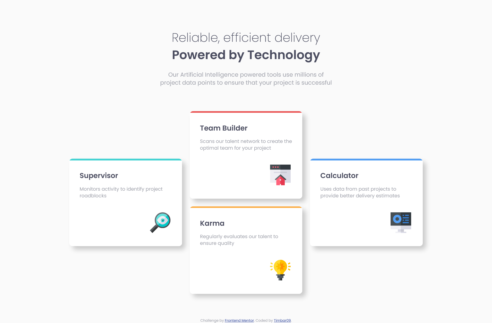
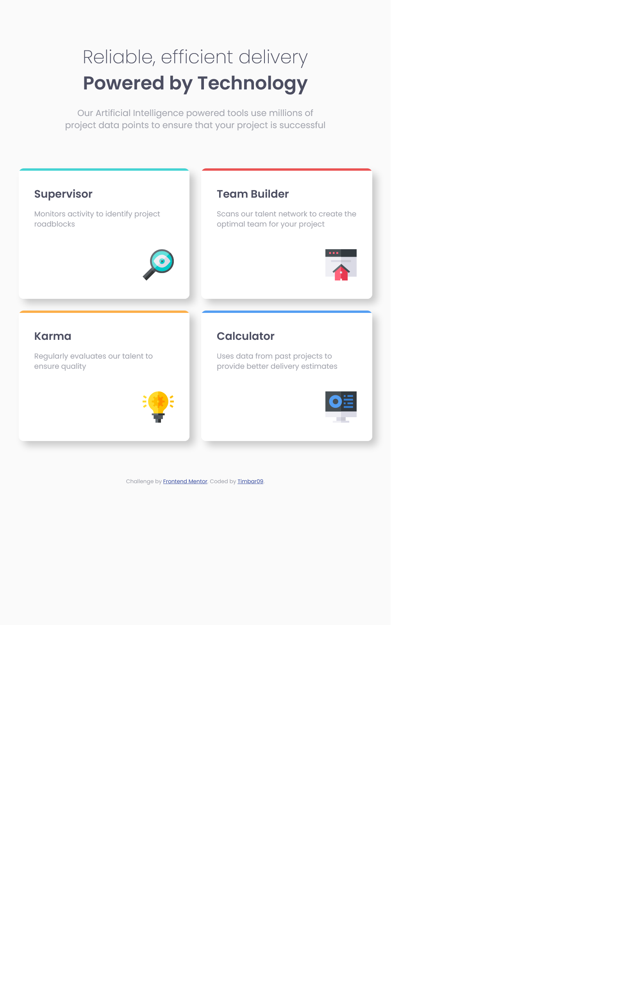
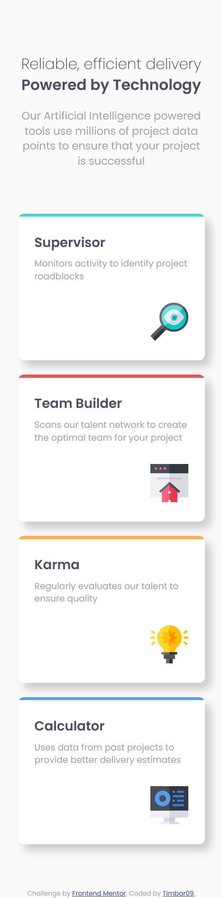

# Frontend Mentor - Four card feature section solution

This is a solution to the [Four card feature section challenge on Frontend Mentor](https://www.frontendmentor.io/challenges/four-card-feature-section-weK1eFYK). Frontend Mentor challenges help you improve your coding skills by building realistic projects. 

## Table of contents

- [Overview](#overview)
  - [The challenge](#the-challenge)
  - [Screenshot](#screenshot)
  - [Links](#links)
- [My process](#my-process)
  - [Built with](#built-with)
  - [What I learned](#what-i-learned)
  - [Continued development](#continued-development)
- [Author](#author)
- [Acknowledgments](#acknowledgments)

## Overview

This is the second challenge from Frontend Mentor that i have completed. It was a bit more difficult than the last one but I took less time to complete it than I initially anticipated.

### The challenge

The site is responsive and viewers can view the optimal layout of the site accross multiple screen sizes such as mobiles phones, tablets and destktops.

### Screenshot





### Links

- Solution URL: [https://github.com/Timbar09/four-card-feature-section.git]
- Live Site URL: [https://mt-four-card-feature.netlify.app/]

## My process

### Built with

- Semantic HTML5 markup
- CSS custom properties
- Flexbox
- CSS Grid
- Mobile-first workflow
- [SASS](https://sass-lang.com/) - CSS3 extension

### What I learned

I have learned to use Github (Desktop version) for thje very first time with this challenge. I have also learned that I can insert SVG code of an image directly into the html markup as opposed to linking the image to html with css as well as interchanging flexbox and grid for the same elements within different viewports.

Use this section to recap over some of your major learnings while working through this project. Writing these out and providing code samples of areas you want to highlight is a great way to reinforce your own knowledge.

To see how you can add code snippets, see below:

```html
<h1>Some HTML code I'm proud of</h1>

<div class="feature__card-icon">
  <svg xmlns="http://www.w3.org/2000/svg" width="64" height="64"><g fill="none"><path fill="#EFEFF4" d="M64 14.454v41.788H0V14.454l3.75-3.787h56.5z"/><path fill="#DADAE5" d="M64 14.454v41.788H32V10.667h28.25z"/><path fill="#474F54" d="M0 0h64v15.515H0z"/><path fill="#32393F" d="M32 0h32v15.515H32z"/><g fill="#FF637B"><path d="M7.758 5.818h3.685v3.879H7.758zM15.128 5.818h3.685v3.879h-3.685zM22.497 5.818h3.685v3.879h-3.685z"/></g><path fill="#FF637B" d="M45.576 42.245V64H34.355v-3.71h-3.74V64H19.394V42.245l11.37-9.275h3.105z"/><path fill="#DADAE5" d="M11.636 22.303h41.697v3.879H11.636z"/><path fill="#C9C9D3" d="M32 22.303h20.364v3.879H32z"/><path fill="#E63950" d="M45.576 42.245V64H33.939v-3.71H32V32.97h1.435z"/><path fill="#EFEFF4" d="M30.061 45.576h3.878v3.879h-3.878z"/><path fill="#DADAE5" d="M32 45.576h1.939v3.879H32z"/><path fill="#676E74" d="M50.424 45.779l-2.452 2.706-15.487-13.526-15.488 13.526-2.452-2.706 17.94-15.718z"/><path fill="#474F54" d="M32 30.061l18.424 15.718-2.518 2.706L32 34.959z"/></g></svg>
</div>
```
```css
.proud-of-this-css {
  display: flex;
  flex-wrap: wrap;
  gap: 1.5rem;
  justify-content: center;
  align-items: center;

  @include breakpoint-up(large) {
    display: grid;
    grid-template-columns: repeat(3, auto);
    grid-template-rows: repeat(4, auto);
  }
}
```
### Continued development

I want to continue using Github as it is relatively new to me and I am beggining to see the benefits of it in my coding development. I would also like to use javaScript and javaScript frameworks such as React in future challenges in oder to add to my skills.

## Author

- Frontend Mentor - [@Timbar09](https://www.frontendmentor.io/profile/yourusername)

## Acknowledgments

Firstly I would like to thank muself for copleting this challenge and I also want to thank Frontend Mentor for helping me and so many others by giving us access to these challenges and helping us develop our coding skills.
